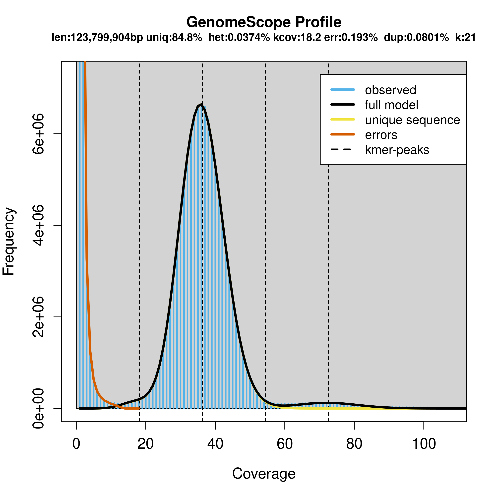
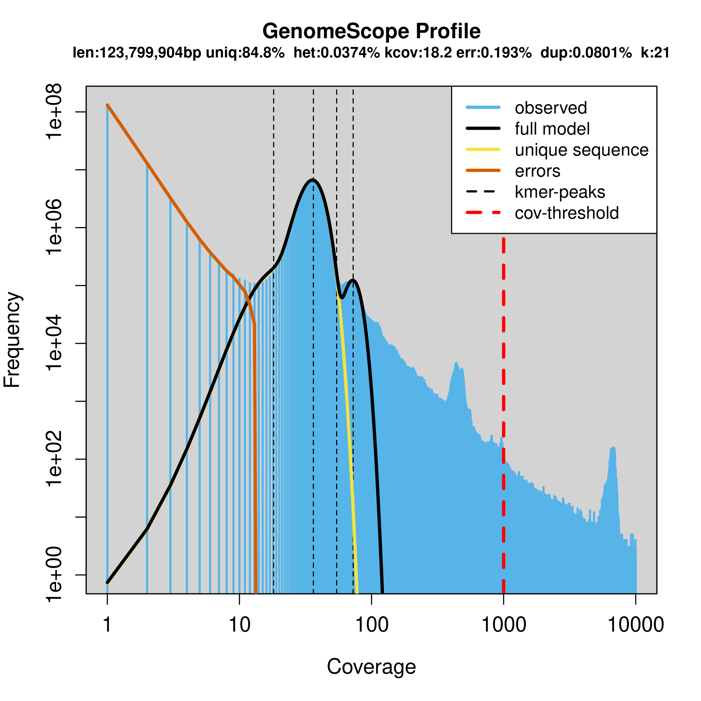
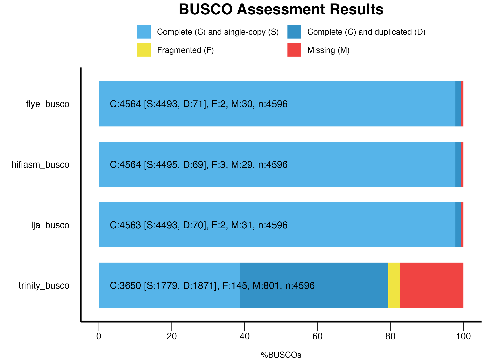
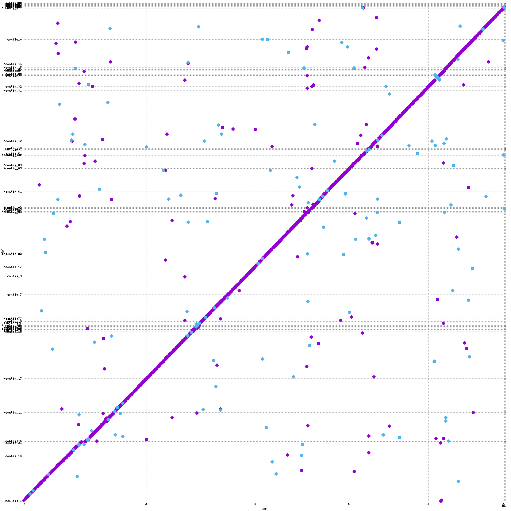
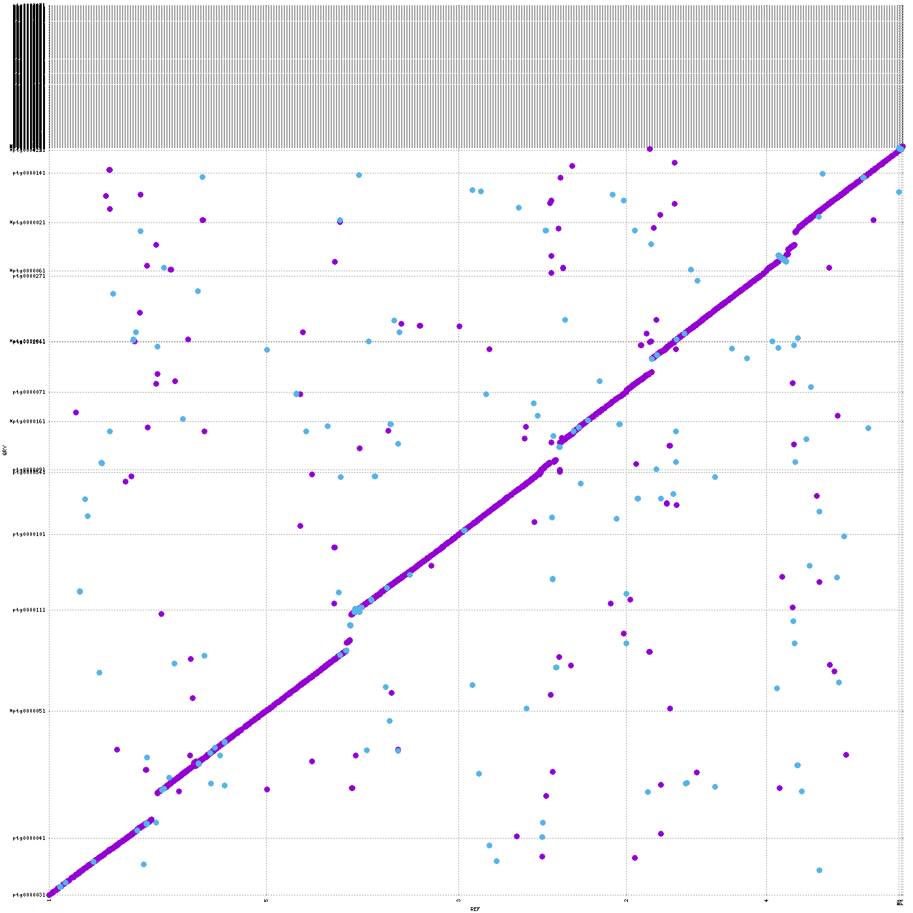
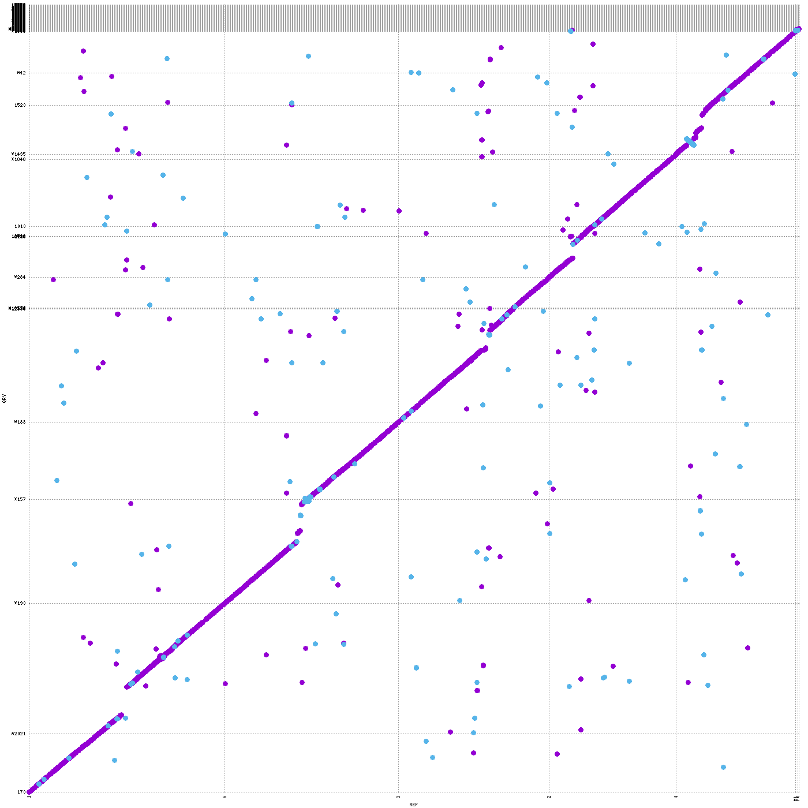
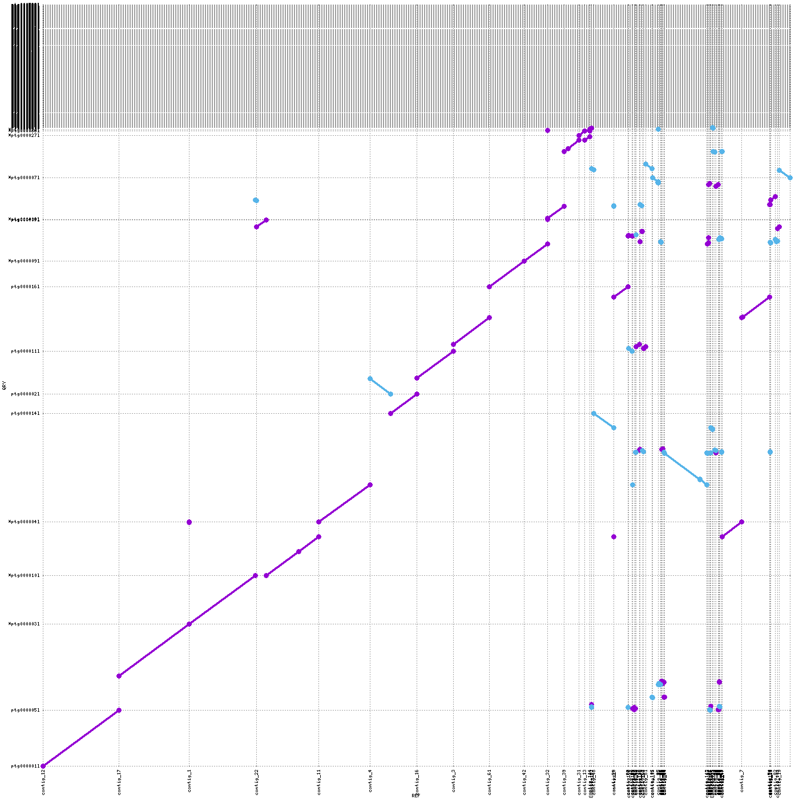
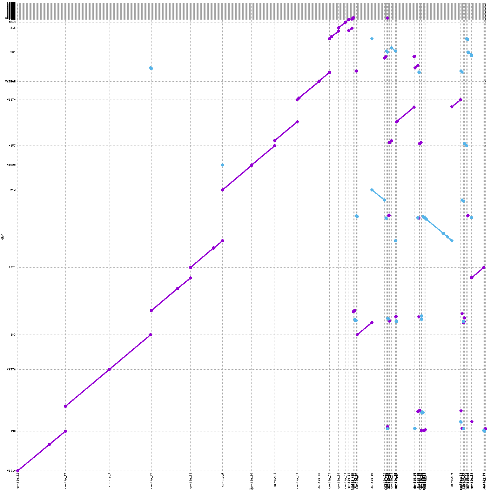
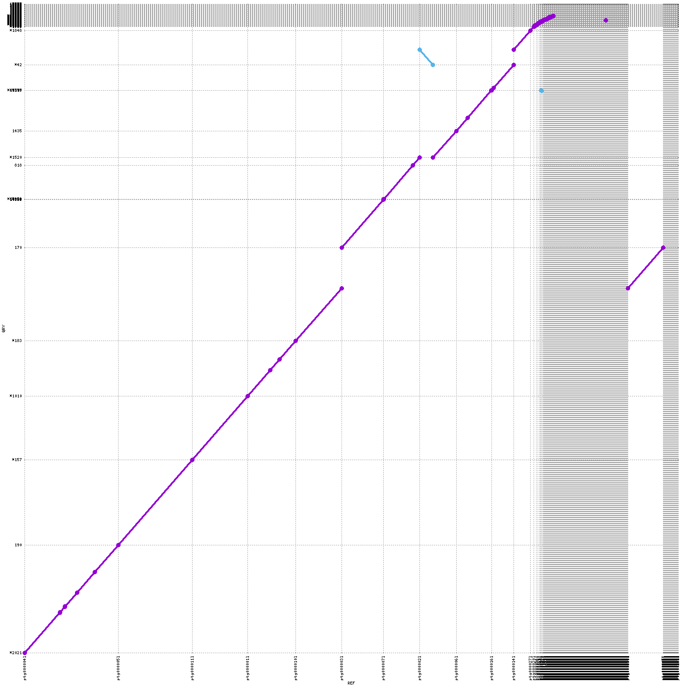

## Part 1 – Reads & Quality Control

### After FastQC

**1. What are the read lengths of the different datasets?**

| Dataset    | Sequencing technology | Read type        | Mean read length (bp)      | Total bases (Gbp) |
| ---------- | --------------------- | ---------------- | -------------------------- | ----------------- |
| MR-0       | PacBio HiFi           | long, single-end | 10 000 – 20 000 (variable) | ≈ 7.2             |
| RNAseq_Sha | Illumina              | paired-end       | 151 (fixed)                | ≈ 2.2             |

**2. Are the datasets of good quality?**

* PacBio HiFi reads show consistently high base quality (Q > 30) across their full length — excellent for assembly.
* Illumina RNA-seq reads (Sha_1 and Sha_2) maintain Q > 30 for most bases with a slight 3′-end drop, typical for RNA-seq.
* %GC is within expected range (MR-0: 37 %, Sha: 46 %), no reads flagged as poor quality.
* Other FastQC modules (sequence length, duplication, N-content, overrepresented sequences) all within expected limits for their respective technologies.

### After FastP

**3. How many reads were trimmed/filtered and did the quality improve?**

Approximately 8–9 % of Illumina reads were filtered out due to adapter contamination or low quality.
After trimming, mean base quality improved by about 3–6 % at Q20–Q30 levels, indicating cleaner, more reliable reads for downstream RNA-seq analysis.

**4. What kind of coverage do you expect from the PacBio WGS reads? (hint: lookup the expected genome size of Arabidopsis thaliana)**

Arabidopsis thaliana has a genome size of roughly 135 Mb.
Given ~20–30 Gb of PacBio HiFi data per accession, this corresponds to an expected coverage of about **150–200×**, ideal for producing high-quality, chromosome-level assemblies.

### After K-mer Counting

  
  

**5. Is the estimated genome size expected?**

GenomeScope estimated 123.8 Mb — very close to the expected 135 Mb for Arabidopsis thaliana.

**6. Is the percentage of heterozygosity expected?**

Estimated heterozygosity was 0.037 %, which is extremely low and fully consistent with Arabidopsis being a predominantly self-fertilising, homozygous species.

**7. Is the coverage expected?**

The main k-mer coverage peak was around 40×, indicating uniform sequencing depth and well-saturated coverage — consistent with the expected data quality.

**8. Bonus: Why are we using canonical k-mers? (use Google)**

Every DNA sequence has a reverse complement (e.g. ATGCGT ↔ ACGCAT).
When counting k-mers, both can appear in the data depending on sequencing orientation.
To avoid double-counting, tools like Jellyfish use canonical k-mers — representing each k-mer by its lexicographically smaller orientation.
This reduces storage requirements, prevents duplication, and ensures strand-independent coverage estimation.

Excellent — your uploaded *Summary Workflow – Part 3* has everything needed to answer all 15 guided questions concisely.
Here’s the complete Markdown-ready section for your `RESULTS.md` (Part 2 – Assembly evaluation and comparing genomes), keeping all questions in their original phrasing.

---

## Part 2 – Assembly evaluation and comparing genomes

### After BUSCO comparison

**1. How do your genome assemblies look according to your BUSCO results?**
All three genome assemblies (Flye, Hifiasm, LJA) show exceptionally high completeness (≈ 99.3 %, 4563–4564 / 4596 BUSCO genes).
Most are single-copy (S ≈ 4493–4495), indicating nearly all expected orthologues were recovered.
Fragmented (F ≤ 3) and missing (M ≈ 29–31) BUSCOs are minimal, confirming highly complete and accurate assemblies.

**2. Is one genome assembly better than the other?**
They are nearly identical in completeness; LJA shows slightly fewer duplicates and an assembly size closest to the expected A. thaliana genome (≈ 135 Mb), so it may best represent a non-redundant haploid reconstruction.

**3. How does your transcriptome assembly look?**
The Trinity assembly has C = 3650 / 4596 (≈ 79.5 %) BUSCOs — good for a transcriptome, but lower than the genomic assemblies.

**4. Are there many duplicated genes? Can you explain the differences with the whole genome assemblies?**
Yes (D = 1871 ≈ 51 %). Duplications stem from alternative splicing and multiple isoforms of expressed genes.
Transcriptome assemblies only include expressed transcripts, not the whole gene set, and RNA-seq coverage is less uniform, leading to fragmented or duplicated BUSCOs.

   
  <em>BUSCO assessment of Flye, Hifiasm, LJA genome assemblies and the Trinity transcriptome.</em>

### After QUAST comparison

**5. How do your genome assemblies look according to your QUAST results?**

* Flye: 120.5 Mb total (76 contigs), N50 = 7.6 Mb, duplication ratio 1.025, GC = 36.05 %.
* Hifiasm: 167.0 Mb (611 contigs), N50 = 10.7 Mb, duplication ratio 1.299 → likely retained alternative haplotypes.
* LJA: 144.0 Mb (483 contigs), N50 = 14.2 Mb, duplication ratio 1.086.
  All cover ≈ 89 % of the reference genome and have matching GC content (~36 %).

**6. Is one genome assembly better than the other?**
LJA achieves the highest N50 and assembly size closest to the true genome, suggesting the best balance between contiguity and accuracy.

**7. What additional information you get if you have a reference available?**
Reference-based QUAST adds alignment metrics (misassemblies, unaligned lengths, mismatches, indels) and reveals structural errors or gaps, providing insight into how contigs align to known chromosomes.

### After Merqury comparison

**8. What are the consensus quality QV and error rate values of your assemblies?**

| Assembly | QV   | Error rate | Accuracy (%) |
| -------- | ---- | ---------- | ------------ |
| Flye     | 56.1 | 2.4 × 10⁻⁶ | 99.9998      |
| Hifiasm  | 54.7 | 3.4 × 10⁻⁶ | 99.9997      |
| LJA      | 55.0 | 3.2 × 10⁻⁶ | 99.9997      |

**9. What is the estimated completeness of your assemblies?**
≈ 99 % for all three, indicating nearly all k-mers from the reads were represented in the assemblies.

**10. How does your copy-number spectra look like? Do they confirm the expected coverage?**
Single-copy (red 1× peak) dominates around 45× coverage, consistent with Arabidopsis expectations.
Higher copy-number colours (blue, green, purple) mark true repeats; grey k-mers (read-only) are minimal. This confirms no major sequence loss or collapse.

**11. Does one assembly perform better than the other?**
All perform very well; Flye has slightly higher QV and completeness, indicating marginally better consensus accuracy. Differences are minor and within normal HiFi variability.

### After Nucmer and Mummer

**12. What does the dotplot show and what do the different colours mean?**
Each dot represents a region of similarity between two assemblies.

* x-axis = reference position (bp)
* y-axis = query assembly position (bp)
  Purple / blue lines = forward alignments; reverse (diagonal top-left to bottom-right) = inversions.
  Breaks or scattered dots = rearrangements or gaps.

**13. Do your genome assemblies look very different from the reference genome?**
No major structural deviations; continuous diagonals indicate high synteny with the Col-0 reference. Small breaks reflect real accession-specific rearrangements rather than assembly errors.

**14. How different are the genome assemblies compared to each other?**
When aligned pairwise (Flye vs Hifiasm, Flye vs LJA, Hifiasm vs LJA), their dotplots show strong agreement along the main diagonal, confirming consistent reconstruction of the MR-0 genome structure.

**15. Compare the different accessions from your group. Do you see any differences between the accessions?**
Across accessions, differences appear mainly as rearranged segments and local gaps in alignment, consistent with known Arabidopsis rearrangement hotspots reported in the paper (euchromatic regions with tandem gene duplications).

---

### Figures

  
   
  <em>Genome-to-reference alignments (Flye and Hifiasm vs Col-0 reference).</em>

  
   
  <em>Assembly-to-assembly alignments (LJA vs reference and Flye vs Hifiasm).</em>

  
   
  <em>Pairwise comparisons between assemblies of the same MR-0 accession to assess assembler consistency.</em>

